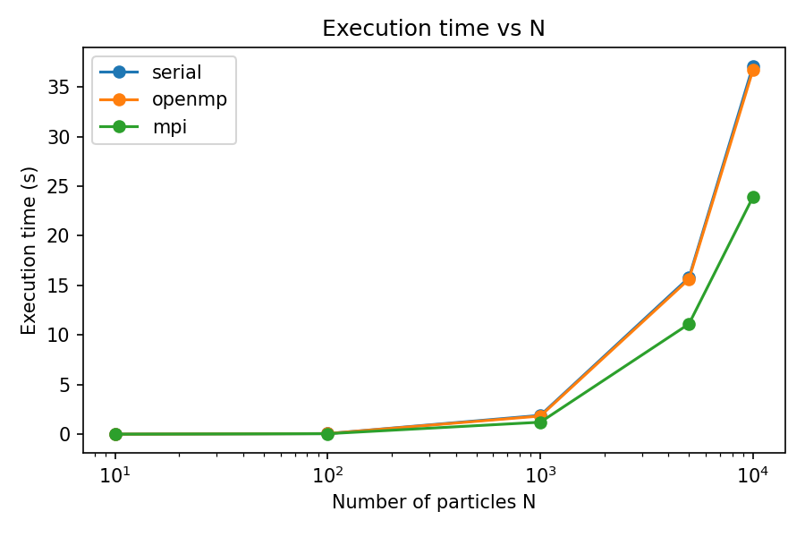
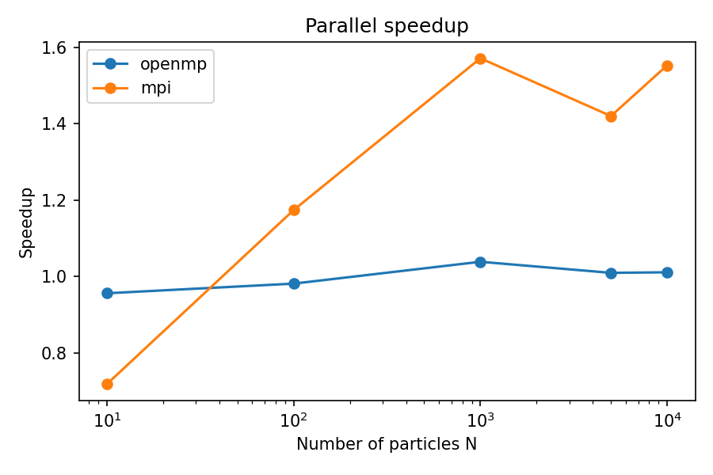
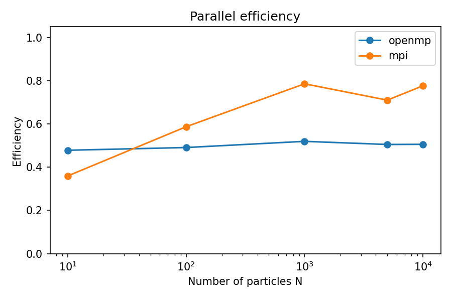

# 🌌 3D N-Body Simulation with Barnes-Hut Algorithm

This project implements a 3D N-Body simulation using the **Barnes-Hut algorithm** to compute gravitational forces.  
The code is written in **Fortran 90** and provides three execution modes: **Serial**, **OpenMP** (Shared Memory Parallelism), and **MPI** (Distributed Memory Parallelism).

---

## 📁 Project Structure

```
├── geometry.f90 # Module: 3D Vector operations and types 
├── particle.f90 # Module: Particle types and properties 
├── barnes_hut.f90 # Module: Tree construction and force calculation (Serial/OpenMP)
├── barnes_hut_mpi.f90 # Module: Distributed Barnes-Hut logic for MPI 
├── main.f90 # Main: Handles Serial and OpenMP versions 
├── main_mpi.f90 # Main: Handles the MPI version 
├── Makefile # Automates compilation and execution 
├── setups/ # Folder containing input configuration files 
│ ├── setup_10.dat 
│ ├── setup_100.dat 
│ └── ... 
├── outputs/ # Folder where simulation results are stored 
├── figures/ # Folder containing performance analysis plots
│ ├── efficiency.png
│ ├── speedup.png 
│ └── time_vs_N.png 
├── animations/ # Folder where the generated GIF animations are saved
├── generate_setups.py # Python script to create input setup files
├── animate.py # Python script to create 3D animations from outputs 
├── analyze_timing.py # Python script for performance analysis
└── timing.dat # File containing execution times for different runs
```

---

## ⚙️ Compilation

A `Makefile` is provided for automatic compilation.

**To compile all versions at once:**
```bash
make all
```

**To compile specific versions:**
```bash
make serial    # Produces nbody_serial
make openmp    # Produces nbody_openmp
make mpi       # Produces nbody_mpi
```

**To clean the project (remove objects, modules, and executables):**
```bash
make all
```

---

## 📥 Initial Conditions & Setups

The simulation requires an input setup file. These can be generated automatically using the provided Python utility:

```bash
python generate_setups.py
```
This script generates spheres of particles uniformly distributed in space. It creates cases for N=[10,100,1000,5000,10000] particles inside the `setups/` folder.

**Input file format:**

Setup files are located in the `setups/` directory and follow this structure:

```lua
dt
dt_out
t_end
n
m1 x1 y1 z1 vx1 vy1 vz1
m2 x2 y2 z2 vx2 vy2 vz2
...
```

Where:
* `dt` → integration time step
* `dt_out` → time interval between successive output records
*  `t_end` → total simulation time
* `n` → number of particles
* `m` → particle mass
* `(x, y, z)` → initial position
* `(vx, vy, vz)` → initial velocity

---

## ▶️ Running the Simulation

The `Makefile` includes automated rules to run the simulation. These rules automatically provide the path to the setup file from the `setups/` folder.


**1. Serial version**
Specify the number of particles (`N`).
```bash
make run_serial N=100
```

**2. OpenMP Version**
Specify the number of particles (`N`) and the number of threads (`T`).

```bash
make run_openmp N=1000 T=2
```

**3. MPI Version**
Specify the number of particles (`N`) and the number of processes (`P`).

```bash
make run_mpi N=5000 P=2
```

Default values are `N=1000`, `T=2`, and `P=2` if parameters are omitted.

---

## 📤 Output and Timing

**Results of the simulation**

Simulation results are saved in the `outputs/` folder with unique names to prevent overwriting (e.g., `output_mpi_n5000.dat`).

The output files contain the positions of all particles at each saved time step. They have the following structure:

```nginx
t  x1 y1 z1  x2 y2 z2  ...  xN yN zN
```

Where:

* Each row corresponds to a simulation time step where data is recorded.
* The first column is time (t).
* The remaining columns are the positions (x, y, z) of each particle.

**Time of execution**

The time of execution of each simulation (depending on the number of particles and the used method) is appended to `timing.dat` after every execution. It has the following structure:

```nginx

mode  n_particles  n_threads/procs  elapsed_time
```

---

## 🎞️ Visualization

The `animate.py` script can be used to visualize the results:

```bash
python animate.py
```

* **3D Animation**: It generates a 3D representation of the particle cluster.
* **Output**: Animations are saved as `.gif` files in the `animations/` folder.

---

## 📊 Performance Analysis

This project includes a Python script (`analyze_timing.py`) to evaluate the performance of the different implementations. It processes the data stored in `timing.dat` to compare execution times, speedup, and efficiency across serial, OpenMP, and MPI modes.

### 📈 Metrics Definition
* **Execution Time:** The total wall-clock time required to complete the simulation.
* **Speedup ($S$):** Calculated as $S = \frac{T_{\text{serial}}}{T_{\text{parallel}}}$, where $T$ is the execution time. It represents how much faster the parallel version is compared to the serial one.
* **Efficiency ($E$):** Calculated as $E = \frac{S}{P}$, where $P$ is the number of cores used (in this study, $P=2$). It measures how well the hardware resources are utilized.


### 📉 Results and Discussion

The following analysis was performed on a **dual-core processor**, meaning both OpenMP and MPI were limited to 2 concurrent threads/processes.

#### 1. Execution Time vs Number of Particles



For small systems ($N \le 100$), the overhead of initializing parallel environments makes all three modes perform similarly. However, for $N \ge 1000$, the **MPI implementation** consistently shows the lowest execution time. The Serial and OpenMP versions remain very close, as the overhead of thread management on only two cores limits the potential gains of the shared-memory approach.

#### 2. Parallel Speedup



The speedup follows the trend of the execution time. While OpenMP provides a very modest improvement over the serial case, the **MPI version** achieves a more significant speedup as $N$ increases. This suggests that the distributed memory approach handles the Barnes-Hut workload more effectively even on limited hardware.

#### 3. Parallel Efficiency



* **OpenMP:** Efficiency remains relatively constant but low, likely due to the dual-core limitation and the overhead of the Barnes-Hut tree synchronization in shared memory.
* **MPI:** Efficiency starts lower for very small $N$ due to communication costs but quickly surpasses OpenMP. It reaches a peak at $N=1000$, shows a slight dip at $N=5000$ (possibly due to cache effects or communication/calculation imbalance), and recovers at $N=10000$ as the computational load heavily outweighs the communication overhead.

---

## 🧠 Implementation Details

* **Algorithm**: Barnes-Hut tree-based force calculation.
* **Parallelism**: 

    * OpenMP: Uses a shared-memory approach for force calculation loops.
    * MPI: Distributes particles across processes; uses `MPI_ALLGATHER` for position synchronization.

* **Precision**: Double precision (`real64`).
* **Modular Design**: Complete separation between geometry logic, physical entities, and the mathematical algorithm.

---

## 👨‍💻 Author

Raquel Garcia Paris  
Programming Techniques - Course Exercise 2  
Universidad de La Laguna - 2025